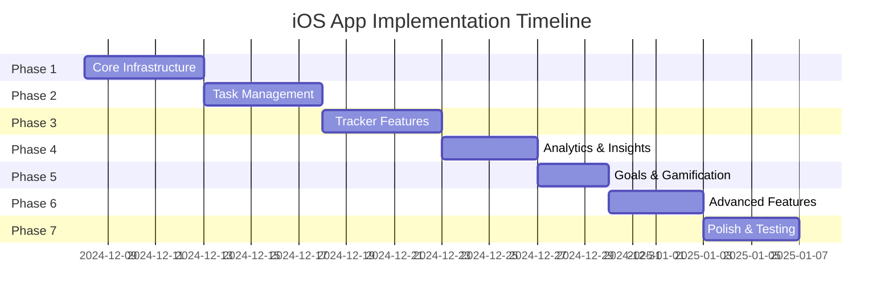

# Tracker Pro iOS App - Complete Implementation Plan

**Version:** 1.0  
**Created:** December 7, 2024  
**Backend API Version:** v1

---

## Executive Summary

This document outlines a comprehensive, phased implementation plan for the Tracker Pro iOS application. The app will be a native iOS client for the existing Django backend, providing users with a premium, feature-rich task and habit tracking experience.

### Current State Analysis

**Backend (Complete):**
The Django backend provides a comprehensive API v1 with:
- **Authentication:** Login, Signup, Logout, Google Sign-In, Auth Status, Email Validation
- **Task Management:** Toggle, Status, Edit, Delete, Bulk Operations, Quick Add
- **Tracker Management:** Create, Update, Delete, Reorder, Share, Export, Templates
- **Analytics & Insights:** Chart Data, Heatmaps, Behavioral Insights, Forecasting
- **Goals & Preferences:** CRUD operations, User Settings
- **Notifications:** List, Mark Read, Mark All Read
- **Sync & Data:** Offline Sync, Data Export/Import, User Profile, Avatar
- **System:** Health Check, Feature Flags

**iOS App (Partial):**
Current implementation includes:
- ✅ App entry point with authentication flow
- ✅ ThemeManager with 12 themes and light/dark variants
- ✅ APIClient with basic authentication endpoints
- ✅ AuthManager for session management
- ✅ Basic views: Dashboard, Today, Settings (stubs)
- ✅ LiquidGlass UI components
- ❌ Task/Tracker management features
- ❌ Analytics and insights views
- ❌ Goals management
- ❌ Offline support and sync
- ❌ Complete data management

---

## Design Philosophy & Look and Feel

### Visual Design Principles

```
┌─────────────────────────────────────────────────────────┐
│                   DESIGN SYSTEM                         │
├─────────────────────────────────────────────────────────┤
│ 🎨 Premium Glassmorphism with LiquidGlass effects       │
│ 🌙 Full Dark/Light mode support per theme               │
│ ✨ Smooth micro-animations throughout                   │
│ 📱 Native iOS feel with SF Symbols                      │
│ 🎯 Haptic feedback for all interactions                 │
│ 🏆 Celebration animations for achievements              │
└─────────────────────────────────────────────────────────┘
```

### App Color Themes (12 themes, each with light/dark variants)
1. **Ocean** - Deep blues to teals
2. **Forest** - Rich greens
3. **Sunset** - Warm oranges and reds
4. **Lavender** - Soft purples
5. **Midnight** - Deep blues with accent colors
6. **Coral** - Warm coral tones
7. **Mint** - Fresh mint greens
8. **Rose** - Elegant rose colors
9. **Amber** - Warm golden tones
10. **Slate** - Professional grays
11. **Crimson** - Bold red accents
12. **Teal** - Modern teal palette

### Typography
- **Primary:** SF Pro Display (Headers)
- **Body:** SF Pro Text (Content)
- **Monospace:** SF Mono (Stats/Numbers)

### Key UI Components
- **Cards:** Rounded corners (16pt), subtle shadows, glassmorphic overlays
- **Buttons:** Gradient fills, 12pt radius, haptic feedback
- **Lists:** Swipe actions, smooth reordering, pull-to-refresh
- **Navigation:** Tab bar with custom icons, floating action buttons
- **Modals:** Bottom sheets with drag gestures

---

## Implementation Phases



---

## Pre-Existing Tracker Templates

The backend provides 8 ready-to-use tracker templates that users can activate with one tap. These should be showcased in the iOS app's Template Library.

### Template Definitions

| Template Key | Name | Period | Tasks |
|-------------|------|--------|-------|
| `morning` | Morning Routine | Daily | 8 tasks |
| `fitness` | Fitness Tracker | Daily | 6 tasks |
| `study` | Study Plan | Daily | 5 tasks |
| `work` | Work Productivity | Daily | 7 tasks |
| `mindfulness` | Mindfulness | Daily | 4 tasks |
| `evening` | Evening Wind Down | Daily | 5 tasks |
| `weekly-review` | Weekly Review | Weekly | 6 tasks |
| `language` | Language Learning | Daily | 5 tasks |

### Template Details

#### 🌅 Morning Routine (`morning`)
Start your day with purpose. Includes meditation, exercise, and planning.
- Wake up at target time (routine, weight: 1, morning)
- Meditation 10 min (mindfulness, weight: 2, morning)
- Morning exercise 30 min (fitness, weight: 3, morning)
- Healthy breakfast (nutrition, weight: 2, morning)
- Review daily goals (planning, weight: 2, morning)
- Shower and get ready (routine, weight: 1, morning)
- Journal 5 min (mindfulness, weight: 1, morning)
- Check calendar and priorities (planning, weight: 1, morning)

#### 💪 Fitness Tracker (`fitness`)
Track workouts, nutrition, and recovery for optimal fitness.
- Cardio workout 30 min (cardio, weight: 3, morning)
- Strength training (strength, weight: 3, afternoon)
- Log meals and track calories (nutrition, weight: 2, evening)
- Drink 8 glasses of water (hydration, weight: 2, anytime)
- Stretching 15 min (flexibility, weight: 1, evening)
- Track weight and measurements (tracking, weight: 1, morning)

#### 📚 Study Plan (`study`)
Structured learning with reading, practice, and review sessions.
- Review notes from previous session (review, weight: 2, morning)
- Active learning 2 hours (study, weight: 3, afternoon)
- Practice problems (practice, weight: 3, afternoon)
- Create flashcards for new concepts (review, weight: 2, evening)
- Evening review 30 min (review, weight: 2, evening)

#### 💼 Work Productivity (`work`)
Focus blocks, email management, and daily planning.
- Plan top 3 priorities (planning, weight: 2, morning)
- Deep work block 1 - 2 hours (focus, weight: 3, morning)
- Check and respond to emails (communication, weight: 1, afternoon)
- Deep work block 2 - 2 hours (focus, weight: 3, afternoon)
- Team meetings and collaboration (collaboration, weight: 2, afternoon)
- Review progress and plan tomorrow (planning, weight: 2, evening)
- Clear inbox to zero (communication, weight: 1, evening)

#### 🧘 Mindfulness (`mindfulness`)
Meditation, gratitude journaling, and mental wellness.
- Morning meditation 15 min (meditation, weight: 3, morning)
- Gratitude journal - 3 things (journaling, weight: 2, morning)
- Midday breathing exercise 5 min (breathwork, weight: 1, afternoon)
- Evening reflection (journaling, weight: 2, evening)

#### 🌙 Evening Wind Down (`evening`)
Prepare for restful sleep with relaxation routines.
- No screens 1 hour before bed (digital detox, weight: 2, evening)
- Light dinner 3 hours before bed (nutrition, weight: 1, evening)
- Evening walk or gentle yoga (movement, weight: 2, evening)
- Read for 30 minutes (relaxation, weight: 2, evening)
- Bedtime routine - skincare, etc. (routine, weight: 1, evening)

#### 📊 Weekly Review (`weekly-review`)
Reflect on the week and plan for success ahead.
- Review completed tasks from week (review, weight: 2, anytime)
- Celebrate wins and progress (reflection, weight: 1, anytime)
- Identify lessons learned (reflection, weight: 2, anytime)
- Plan goals for next week (planning, weight: 3, anytime)
- Schedule important tasks (planning, weight: 2, anytime)
- Review analytics and adjust habits (optimization, weight: 2, anytime)

#### 🗣️ Language Learning (`language`)
Vocabulary, grammar, speaking practice, and immersion.
- App practice 15 min (digital practice, weight: 2, morning)
- Learn 10 new vocabulary words (vocabulary, weight: 2, morning)
- Grammar exercises (grammar, weight: 2, afternoon)
- Speaking practice 10 min (speaking, weight: 3, afternoon)
- Watch content in target language (immersion, weight: 2, evening)

---

## Phase 1: Core Infrastructure & Data Layer (Days 1-5)

### Objectives
- Establish robust networking layer
- Create data models matching backend
- Implement local persistence
- Set up ViewModels pattern

### Files to Create/Modify

---

#### [NEW] Core/Models/TaskModels.swift

```swift
// Task-related data models
struct Task: Identifiable, Codable {
    let taskInstanceId: String
    var status: TaskStatus
    var notes: String?
    let template: TaskTemplate
    let trackerInstanceId: String
    let createdAt: Date?
    var completedAt: Date?
    
    var id: String { taskInstanceId }
}

enum TaskStatus: String, Codable {
    case todo = "TODO"
    case inProgress = "IN_PROGRESS"
    case done = "DONE"
    case skipped = "SKIPPED"
    case missed = "MISSED"
    case blocked = "BLOCKED"
}

struct TaskTemplate: Codable {
    let templateId: String
    let description: String
    let category: String
    let weight: Int
    let timeOfDay: TimeOfDay
}

enum TimeOfDay: String, Codable {
    case morning, afternoon, evening, anytime
}
```

---

#### [NEW] Core/Models/TrackerModels.swift

```swift
// Tracker-related data models
struct Tracker: Identifiable, Codable {
    let trackerId: String
    let name: String
    let description: String?
    let timeMode: TimeMode
    let status: TrackerStatus
    let icon: String?
    let color: String?
    let shareToken: String?
    let createdAt: Date?
    
    var id: String { trackerId }
}

enum TimeMode: String, Codable {
    case daily, weekly, monthly
}

enum TrackerStatus: String, Codable {
    case active, paused, archived
}

struct TrackerInstance: Identifiable, Codable {
    let trackerInstanceId: String
    let trackerId: String
    let periodStart: Date
    let periodEnd: Date
    let tasks: [Task]
    
    var id: String { trackerInstanceId }
}
```

---

#### [NEW] Core/Models/GoalModels.swift

```swift
// Goal data models
struct Goal: Identifiable, Codable {
    let goalId: String
    let title: String
    let description: String?
    let icon: String
    let goalType: GoalType
    let targetDate: Date?
    let targetValue: Double?
    let currentValue: Double?
    let unit: String?
    let status: GoalStatus
    let priority: Int
    let progress: Double
    
    var id: String { goalId }
}

enum GoalType: String, Codable {
    case habit, milestone, numeric, streak
}

enum GoalStatus: String, Codable {
    case active, completed, archived
}
```

---

#### [NEW] Core/Models/UserModels.swift

```swift
// User and preferences models
struct UserProfile: Codable {
    let firstName: String
    let lastName: String
    let email: String
    let username: String
    let timezone: String
    let dateFormat: String
    let weekStart: Int
}

struct UserPreferences: Codable {
    var theme: String
    var defaultView: String
    var timezone: String
    var dateFormat: String
    var weekStart: Int
    var dailyReminderEnabled: Bool
    var soundComplete: Bool
    var soundNotify: Bool
    var soundVolume: Double
    var compactMode: Bool
    var animations: Bool
    var keyboardEnabled: Bool
    var pushEnabled: Bool
}

struct Notification: Identifiable, Codable {
    let notificationId: String
    let type: String
    let title: String
    let message: String
    let link: String?
    let isRead: Bool
    let createdAt: Date?
    
    var id: String { notificationId }
}
```

---

#### [NEW] Core/Models/AnalyticsModels.swift

```swift
// Analytics and insights models
struct AnalyticsData: Codable {
    let completionTrend: CompletionTrend
    let categoryDistribution: [String: Int]
    let timeOfDayStats: [String: Int]
    let heatmap: [[HeatmapCell]]
    let insights: [Insight]
    let summary: AnalyticsSummary
}

struct CompletionTrend: Codable {
    let labels: [String]
    let datasets: [TrendDataset]
}

struct TrendDataset: Codable {
    let label: String
    let data: [Double]
}

struct HeatmapCell: Codable {
    let date: String?
    let level: Int
    let count: Int
    let total: Int?
    let rate: Int?
}

struct Insight: Identifiable, Codable {
    let id = UUID()
    let type: String
    let severity: InsightSeverity
    let description: String
    let trackerName: String?
    let trackerId: String?
    let actions: [InsightAction]?
}

enum InsightSeverity: String, Codable {
    case high, medium, low
}

struct InsightAction: Codable {
    let label: String
    let url: String?
}

struct AnalyticsSummary: Codable {
    let totalTasks: Int
    let completedTasks: Int
    let completionRate: Double
    let currentStreak: Int
    let bestStreak: Int
}

struct Forecast: Codable {
    let predictions: [Double]
    let upperBound: [Double]
    let lowerBound: [Double]
    let confidence: Double
    let trend: String
    let dates: [String]
    let labels: [String]
}

struct SmartSuggestion: Identifiable, Codable {
    let id = UUID()
    let type: String
    let icon: String
    let message: String
    let detail: String?
    let action: SuggestionAction?
}

struct SuggestionAction: Codable {
    let label: String
    let url: String
}
```

---

#### [MODIFY] Core/API/APIClient.swift

Add comprehensive endpoint extensions:

```swift
// Add Task Endpoints
extension APIClient {
    func toggleTask(taskId: String) async throws -> TaskToggleResponse
    func updateTaskStatus(taskId: String, status: String, notes: String?) async throws -> APIResponse<Task>
    func editTask(taskId: String, data: TaskEditRequest) async throws -> APIResponse<Task>
    func deleteTask(taskId: String) async throws -> APIResponse<Empty>
    func addTask(trackerId: String, description: String, category: String?, weight: Int?, timeOfDay: String?) async throws -> APIResponse<Task>
    func bulkUpdateTasks(taskIds: [String], action: String) async throws -> APIResponse<BulkResult>
}

// Add Tracker Endpoints
extension APIClient {
    func createTracker(data: TrackerCreateRequest) async throws -> APIResponse<Tracker>
    func updateTracker(trackerId: String, data: TrackerUpdateRequest) async throws -> APIResponse<Tracker>
    func deleteTracker(trackerId: String) async throws -> APIResponse<Empty>
    func reorderTasks(trackerId: String, order: [String]) async throws -> APIResponse<Empty>
    func shareTracker(trackerId: String) async throws -> ShareResponse
    func exportTracker(trackerId: String, format: String) async throws -> Data
    func activateTemplate(templateKey: String) async throws -> TemplateActivateResponse
}

// Add Analytics Endpoints
extension APIClient {
    func fetchInsights(trackerId: String?) async throws -> InsightsResponse
    func fetchChartData(type: String, trackerId: String?, days: Int) async throws -> ChartDataResponse
    func fetchHeatmap(trackerId: String?, weeks: Int) async throws -> HeatmapResponse
    func fetchAnalyticsData(days: Int, trackerId: String?) async throws -> APIResponse<AnalyticsData>
    func fetchForecast(days: Int, historyDays: Int, trackerId: String?) async throws -> ForecastResponse
    func fetchSuggestions() async throws -> SuggestionsResponse
}

// Add Goals Endpoints
extension APIClient {
    func fetchGoals(page: Int, perPage: Int, status: String?, sort: String?) async throws -> GoalsResponse
    func createGoal(data: GoalCreateRequest) async throws -> APIResponse<Goal>
    func updateGoal(goalId: String, data: GoalUpdateRequest) async throws -> APIResponse<Goal>
    func deleteGoal(goalId: String) async throws -> APIResponse<Empty>
}

// Add Preferences & Profile Endpoints
extension APIClient {
    func fetchPreferences() async throws -> PreferencesResponse
    func updatePreferences(data: UserPreferences) async throws -> APIResponse<Empty>
    func fetchProfile() async throws -> ProfileResponse
    func updateProfile(data: ProfileUpdateRequest) async throws -> ProfileResponse
    func uploadAvatar(imageData: Data) async throws -> AvatarResponse
    func deleteAvatar() async throws -> APIResponse<Empty>
}

// Add Notifications Endpoints
extension APIClient {
    func fetchNotifications() async throws -> NotificationsResponse
    func markNotificationsRead(ids: [String]) async throws -> APIResponse<Empty>
    func markAllNotificationsRead() async throws -> APIResponse<Empty>
}

// Add Data Management Endpoints
extension APIClient {
    func exportData(format: String) async throws -> Data
    func importData(fileData: Data) async throws -> ImportResponse
    func clearData(confirmation: String) async throws -> ClearDataResponse
    func deleteAccount(confirmation: String, password: String) async throws -> APIResponse<Empty>
}

// Add Sync & Utility Endpoints
extension APIClient {
    func sync(request: SyncRequest) async throws -> SyncResponse
    func prefetch(panels: [String]) async throws -> PrefetchResponse
    func fetchFeatureFlag(flagName: String) async throws -> FeatureFlagResponse
    func healthCheck() async throws -> HealthResponse
    func undo(actionType: String, actionData: [String: Any]) async throws -> APIResponse<Empty>
}
```

---

#### [NEW] Core/Services/TaskService.swift

```swift
// Task service layer
@Observable
class TaskService {
    private let apiClient = APIClient.shared
    
    var todayTasks: [Task] = []
    var isLoading = false
    var error: String?
    
    func fetchTodayTasks() async
    func toggleTask(_ taskId: String) async -> Bool
    func updateTaskStatus(_ taskId: String, status: TaskStatus, notes: String?) async
    func quickAddTask(to trackerId: String, description: String) async
    func deleteTask(_ taskId: String) async
    func bulkUpdate(taskIds: [String], action: String) async
}
```

---

#### [NEW] Core/Services/TrackerService.swift

```swift
// Tracker service layer
@Observable
class TrackerService {
    private let apiClient = APIClient.shared
    
    var trackers: [Tracker] = []
    var selectedTracker: Tracker?
    var isLoading = false
    var error: String?
    
    func fetchTrackers() async
    func createTracker(_ data: TrackerCreateRequest) async
    func updateTracker(_ trackerId: String, data: TrackerUpdateRequest) async
    func deleteTracker(_ trackerId: String) async
    func reorderTasks(_ trackerId: String, order: [String]) async
    func shareTracker(_ trackerId: String) async -> String?
    func activateTemplate(_ templateKey: String) async -> String?
}
```

---

#### [NEW] Core/Services/SyncService.swift

```swift
// Offline-first sync service
@Observable
class SyncService {
    private let apiClient = APIClient.shared
    private var pendingActions: [PendingAction] = []
    private var lastSyncTime: Date?
    
    var isSyncing = false
    var syncError: String?
    
    func sync() async
    func queueAction(_ action: PendingAction)
    func processPendingActions() async
    private func loadPendingActions()
    private func savePendingActions()
}

struct PendingAction: Codable {
    let id: String
    let type: ActionType
    let data: [String: String]
    let timestamp: Date
}

enum ActionType: String, Codable {
    case toggleTask, updateTaskStatus, createTask, deleteTask
    case createTracker, updateTracker, deleteTracker
    case createGoal, updateGoal, deleteGoal
}
```

---

#### [NEW] Core/Persistence/LocalStorage.swift

```swift
// SwiftData or UserDefaults based persistence
import SwiftData

@Model
class CachedTask {
    @Attribute(.unique) var taskInstanceId: String
    var status: String
    var notes: String?
    var templateDescription: String
    var category: String
    var weight: Int
    var timeOfDay: String
    var trackerInstanceId: String
    var lastUpdated: Date
}

@Model
class CachedTracker {
    @Attribute(.unique) var trackerId: String
    var name: String
    var description_: String?
    var timeMode: String
    var status: String
    var icon: String?
    var color: String?
    var lastUpdated: Date
}

actor LocalStorageManager {
    static let shared = LocalStorageManager()
    
    func cacheTasks(_ tasks: [Task]) async
    func getCachedTasks() async -> [Task]
    func cacheTrackers(_ trackers: [Tracker]) async
    func getCachedTrackers() async -> [Tracker]
    func clearCache() async
}
```

---

## Phase 2: Task Management Features (Days 6-10)

### Objectives
- Complete task list views
- Implement task interactions
- Add swipe actions and gestures
- Build task detail/edit sheets

### Files to Create/Modify

---

#### [MODIFY] Features/Today/Views/TodayView.swift

Complete implementation with:
- Grouped task list by time of day (Morning/Afternoon/Evening/Anytime)
- Swipe actions (Complete, Skip, Delete)
- Tap to toggle status
- Long press for quick actions menu
- Pull-to-refresh
- Floating action button for quick add
- Progress ring header showing completion rate
- Day navigation (previous/next day)

---

#### [NEW] Features/Today/Views/TaskRowView.swift

```swift
struct TaskRowView: View {
    let task: Task
    let onToggle: () -> Void
    let onEdit: () -> Void
    let onDelete: () -> Void
    
    @Environment(\.themeManager) private var theme
    @State private var offset: CGFloat = 0
    
    // Sliding action gestures
    // Status icon with animation
    // Category chip
    // Weight indicator
    // Notes preview
}
```

---

#### [NEW] Features/Today/Views/TaskDetailSheet.swift

```swift
struct TaskDetailSheet: View {
    let task: Task
    @Binding var isPresented: Bool
    
    // Full task details
    // Edit mode toggle
    // Status picker
    // Notes editor
    // History timeline
    // Delete confirmation
}
```

---

#### [NEW] Features/Today/Views/QuickAddTaskSheet.swift

```swift
struct QuickAddTaskSheet: View {
    @Binding var isPresented: Bool
    let trackerId: String
    let onAdd: (String, String?, Int?) -> Void
    
    // Description input
    // Optional category picker
    // Optional weight slider
    // Time of day picker
    // Smart suggestions
}
```

---

#### [NEW] Features/Today/Views/DayProgressHeader.swift

```swift
struct DayProgressHeader: View {
    let completedCount: Int
    let totalCount: Int
    let date: Date
    
    // Circular progress ring
    // Percentage text
    // Date navigation arrows
    // Motivational message based on progress
}
```

---

#### [NEW] Features/Tasks/ViewModels/TaskViewModel.swift

```swift
@Observable
class TaskViewModel {
    private let taskService: TaskService
    
    var tasks: [Task] = []
    var groupedTasks: [TimeOfDay: [Task]] = [:]
    var selectedDate: Date = .now
    var isLoading = false
    var error: String?
    
    // Task by time of day grouping
    var morningTasks: [Task] { groupedTasks[.morning] ?? [] }
    var afternoonTasks: [Task] { groupedTasks[.afternoon] ?? [] }
    var eveningTasks: [Task] { groupedTasks[.evening] ?? [] }
    var anytimeTasks: [Task] { groupedTasks[.anytime] ?? [] }
    
    // Stats
    var completedCount: Int
    var totalCount: Int
    var completionRate: Double
    
    func fetchTasks() async
    func toggleTask(_ task: Task) async
    func updateStatus(_ task: Task, status: TaskStatus) async
    func addTask(description: String, to trackerId: String) async
    func deleteTask(_ task: Task) async
    func navigateToDate(_ date: Date)
}
```

---

## Phase 3: Tracker Management (Days 11-15)

### Objectives
- Tracker list with cards
- Tracker detail view
- Create/Edit tracker flow
- Task reordering within trackers
- Template library
- **Floating Action Button (FAB) for creating new trackers**

### Floating Action Button (FAB) Specification

When the Dashboard or Tracker List view opens, display a floating action button with a `+` symbol at the bottom-right corner:

```
┌─────────────────────────────────────┐
│         Dashboard / Trackers        │
│                                     │
│   ┌──────────┐  ┌──────────┐       │
│   │ Tracker1 │  │ Tracker2 │       │
│   └──────────┘  └──────────┘       │
│                                     │
│   ┌──────────┐  ┌──────────┐       │
│   │ Tracker3 │  │ Tracker4 │       │
│   └──────────┘  └──────────┘       │
│                                     │
│                              ┌────┐ │
│                              │ ＋ │ │
│                              └────┘ │
└─────────────────────────────────────┘
```

**On FAB Tap - Show Action Sheet/Bottom Sheet with options:**
1. **📋 Use Template** → Opens Template Library modal with 8 pre-built templates
2. **✏️ Create Custom** → Opens Create Tracker wizard for manual setup

**Implementation Notes:**
- FAB should have a subtle shadow and pulse animation on load
- Use haptic feedback on tap
- The action sheet should use glassmorphism styling
- Animate FAB button rotation when sheet opens

### Files to Create/Modify

---

#### [MODIFY] Features/Dashboard/Views/DashboardView.swift

Complete dashboard with:
- Today's summary card
- Active trackers grid/list
- Quick actions (Add tracker, View all)
- Recent activity feed
- Streak display
- Smart suggestions carousel

---

#### [NEW] Features/Trackers/Views/TrackerListView.swift

```swift
struct TrackerListView: View {
    @State private var viewModel = TrackerViewModel()
    @State private var showCreateSheet = false
    @State private var showTemplates = false
    
    // Toggle between grid and list view
    // Sort/filter options
    // Search bar
    // Tracker cards with progress
}
```

---

#### [NEW] Features/Trackers/Views/TrackerCardView.swift

```swift
struct TrackerCardView: View {
    let tracker: Tracker
    let todayProgress: (completed: Int, total: Int)
    
    // Icon and name
    // Progress bar
    // Status indicator
    // Tap to navigate to detail
    // Context menu (Edit, Share, Delete)
}
```

---

#### [NEW] Features/Trackers/Views/TrackerDetailView.swift

```swift
struct TrackerDetailView: View {
    let trackerId: String
    @State private var viewModel: TrackerDetailViewModel
    
    // Header with icon, name, description
    // Edit button
    // Task list with drag-to-reorder
    // Add task button
    // Stats section
    // Share button
    // Export options
    // Delete (with confirmation)
}
```

---

#### [NEW] Features/Trackers/Views/CreateTrackerSheet.swift

```swift
struct CreateTrackerSheet: View {
    @Binding var isPresented: Bool
    let onCreated: (Tracker) -> Void
    
    // Multi-step wizard:
    // 1. Name and description
    // 2. Time mode (daily/weekly/monthly)
    // 3. Icon and color picker
    // 4. Add initial tasks (optional)
    // 5. Review and create
}
```

---

#### [NEW] Features/Trackers/Views/TemplateLibraryView.swift

```swift
struct TemplateLibraryView: View {
    @State private var templates: [TrackerTemplate] = []
    
    // Morning Routine
    // Fitness Tracker
    // Study Plan
    // Work Productivity
    // Mindfulness
    // Evening Wind Down
    // Weekly Review
    // Language Learning
    
    // Template preview
    // One-tap activate
}
```

---

#### [NEW] Features/Trackers/ViewModels/TrackerViewModel.swift

```swift
@Observable
class TrackerViewModel {
    private let trackerService: TrackerService
    
    var trackers: [Tracker] = []
    var isLoading = false
    var error: String?
    var sortOrder: TrackerSortOrder = .name
    var filterStatus: TrackerStatus? = nil
    
    var sortedTrackers: [Tracker] { /* sorted and filtered */ }
    
    func fetchTrackers() async
    func createTracker(_ data: TrackerCreateRequest) async
    func deleteTracker(_ tracker: Tracker) async
    func activateTemplate(_ key: String) async
}
```

---

## Phase 4: Analytics & Insights (Days 16-19)

### Objectives
- Analytics dashboard
- Interactive charts
- Heatmap visualization
- Behavioral insights
- Forecasting display

### Files to Create/Modify

---

#### [NEW] Features/Analytics/Views/AnalyticsView.swift

```swift
struct AnalyticsView: View {
    @State private var viewModel = AnalyticsViewModel()
    @State private var selectedPeriod: AnalyticsPeriod = .month
    @State private var selectedTracker: Tracker? = nil
    
    // Period selector (Week/Month/Year)
    // Tracker filter dropdown
    // Summary cards row
    // Completion trend chart
    // Category distribution pie chart
    // Time of day bar chart
    // Heatmap calendar
    // Insights list
    // Forecast section
}
```

---

#### [NEW] Features/Analytics/Views/CompletionChartView.swift

```swift
struct CompletionChartView: View {
    let data: CompletionTrend
    
    // Swift Charts line chart
    // Animated drawing
    // Tap for details
    // Today marker
}
```

---

#### [NEW] Features/Analytics/Views/HeatmapView.swift

```swift
struct HeatmapView: View {
    let weeks: [[HeatmapCell]]
    
    // GitHub-style contribution heatmap
    // Color intensity based on level (0-4)
    // Day labels (Sun-Sat)
    // Month labels
    // Tap cell for details popover
}
```

---

#### [NEW] Features/Analytics/Views/InsightsListView.swift

```swift
struct InsightsListView: View {
    let insights: [Insight]
    
    // Severity-colored cards
    // Icon + description
    // Action buttons
    // Expandable details
}
```

---

#### [NEW] Features/Analytics/Views/ForecastView.swift

```swift
struct ForecastView: View {
    let forecast: Forecast
    let summary: ForecastSummary
    
    // Prediction line with confidence bands
    // Trend indicator (↑ increasing, ↓ decreasing)
    // Recommendation text
    // Confidence percentage
}
```

---

#### [NEW] Features/Analytics/ViewModels/AnalyticsViewModel.swift

```swift
@Observable
class AnalyticsViewModel {
    private let apiClient = APIClient.shared
    
    var analyticsData: AnalyticsData?
    var forecast: Forecast?
    var suggestions: [SmartSuggestion] = []
    var isLoading = false
    var error: String?
    var selectedDays: Int = 30
    var selectedTrackerId: String?
    
    func fetchAnalytics() async
    func fetchForecast() async
    func fetchSuggestions() async
}
```

---

## Phase 5: Goals & Gamification (Days 20-22)

### Objectives
- Goals list and creation
- Progress tracking
- Streak displays
- Achievement celebrations

### Files to Create/Modify

---

#### [NEW] Features/Goals/Views/GoalsListView.swift

```swift
struct GoalsListView: View {
    @State private var viewModel = GoalsViewModel()
    @State private var showCreateSheet = false
    @State private var filterStatus: GoalStatus? = nil
    
    // Active goals section
    // Completed goals (collapsible)
    // Archived (collapsible)
    // Progress cards
    // FAB for new goal
}
```

---

#### [NEW] Features/Goals/Views/GoalCardView.swift

```swift
struct GoalCardView: View {
    let goal: Goal
    
    // Icon and title
    // Progress bar/ring
    // Target date countdown
    // Current vs target value
    // Priority badge
}
```

---

#### [NEW] Features/Goals/Views/CreateGoalSheet.swift

```swift
struct CreateGoalSheet: View {
    @Binding var isPresented: Bool
    
    // Goal type picker (Habit, Milestone, Numeric, Streak)
    // Title and description
    // Icon picker
    // Target date (optional)
    // Target value (for numeric)
    // Priority slider
}
```

---

#### [NEW] Features/Goals/Views/GoalDetailView.swift

```swift
struct GoalDetailView: View {
    let goalId: String
    @State private var goal: Goal?
    
    // Large progress visualization
    // Edit button
    // History/timeline
    // Manual progress update
    // Mark complete
    // Archive/Delete
}
```

---

#### [NEW] Features/Shared/Views/CelebrationView.swift

```swift
struct CelebrationView: View {
    let message: String
    let animationType: CelebrationType
    
    enum CelebrationType {
        case confetti, streak, trophy, star
    }
    
    // Full-screen celebration overlay
    // Particle animations
    // Haptic feedback
    // Auto-dismiss after animation
}
```

---

## Phase 6: Advanced Features (Days 23-26)

### Objectives
- Complete settings
- Notification preferences
- Data management
- Profile editing
- Offline support finalization

### Files to Create/Modify

---

#### [MODIFY] Features/Settings/Views/SettingsView.swift

Complete settings with sections:

```swift
struct SettingsView: View {
    // Profile Section
    // - Avatar upload/change
    // - Name editing
    // - Email display
    
    // Appearance Section
    // - Theme picker (12 themes)
    // - Dark mode toggle
    // - Compact mode toggle
    // - Animations toggle
    
    // Preferences Section
    // - Default view picker
    // - Week start day
    // - Date format
    // - Timezone
    
    // Notifications Section
    // - Daily reminder toggle
    // - Reminder time picker
    // - Push notifications toggle
    // - Sound settings
    
    // Data Section
    // - Export data
    // - Import data
    // - Clear all data
    
    // Account Section
    // - Delete account
    // - Logout
    
    // About Section
    // - Version info
    // - Terms of service
    // - Privacy policy
    // - Support link
}
```

---

#### [NEW] Features/Settings/Views/ThemePickerView.swift

```swift
struct ThemePickerView: View {
    @Environment(\.themeManager) private var themeManager
    
    // 12 theme cards in grid
    // Preview colors
    // Current selection indicator
    // Tap to change with animation
}
```

---

#### [NEW] Features/Settings/Views/ProfileEditView.swift

```swift
struct ProfileEditView: View {
    @State private var profile: UserProfile
    @State private var avatarImage: UIImage?
    
    // Avatar with camera/gallery picker
    // First/Last name fields
    // Email (read-only or with verification)
    // Timezone picker
    // Date format picker
    // Week start picker
    // Save button
}
```

---

#### [NEW] Features/Settings/Views/DataManagementView.swift

```swift
struct DataManagementView: View {
    @State private var showExportOptions = false
    @State private var showImportPicker = false
    @State private var showClearConfirmation = false
    @State private var showDeleteAccountConfirmation = false
    
    // Export button with format options (JSON/CSV)
    // Import button with file picker
    // Clear data with double confirmation
    // Delete account with password confirmation
}
```

---

#### [NEW] Features/Notifications/Views/NotificationCenterView.swift

```swift
struct NotificationCenterView: View {
    @State private var notifications: [Notification] = []
    @State private var unreadCount: Int = 0
    
    // Notification list grouped by date
    // Unread badge
    // Swipe to mark read
    // Mark all read button
    // Pull to refresh
}
```

---

## Phase 7: Polish & Testing (Days 27-30)

### Objectives
- Performance optimization
- Animation refinements
- Error handling improvements
- Accessibility
- Final testing

### Polish Tasks

1. **Performance**
   - Lazy loading for long lists
   - Image caching
   - Prefetching adjacent data
   - Memory profiling

2. **Animations**
   - Task completion celebration
   - Smooth transitions between views
   - Loading skeleton views
   - Pull-to-refresh animations

3. **Error Handling**
   - Network error recovery UI
   - Retry mechanisms
   - Offline mode indicators
   - Graceful degradation

4. **Accessibility**
   - VoiceOver labels
   - Dynamic type support
   - High contrast mode
   - Reduce motion support

5. **Haptics**
   - Success feedback on task complete
   - Warning feedback on skip
   - Light feedback on navigation
   - Heavy feedback on delete

---

## Complete File Structure

```
tackerIOS/
├── tackerIOSApp.swift
├── ContentView.swift
├── Core/
│   ├── API/
│   │   └── APIClient.swift (MODIFY - add all endpoints)
│   ├── Auth/
│   │   └── AuthManager.swift (existing)
│   ├── Config/
│   │   └── AppConfig.swift (existing)
│   ├── Models/
│   │   ├── Models.swift (existing - review)
│   │   ├── TaskModels.swift (NEW)
│   │   ├── TrackerModels.swift (NEW)
│   │   ├── GoalModels.swift (NEW)
│   │   ├── UserModels.swift (NEW)
│   │   └── AnalyticsModels.swift (NEW)
│   ├── Services/
│   │   ├── TaskService.swift (NEW)
│   │   ├── TrackerService.swift (NEW)
│   │   ├── GoalService.swift (NEW)
│   │   ├── AnalyticsService.swift (NEW)
│   │   └── SyncService.swift (NEW)
│   ├── Persistence/
│   │   └── LocalStorage.swift (NEW)
│   └── Theme/
│       └── ThemeManager.swift (existing)
├── Features/
│   ├── Auth/
│   │   └── Views/
│   │       └── AuthViews.swift (existing)
│   ├── Dashboard/
│   │   ├── Views/
│   │   │   └── DashboardView.swift (MODIFY)
│   │   └── ViewModels/
│   │       └── DashboardViewModel.swift (NEW)
│   ├── Today/
│   │   ├── Views/
│   │   │   ├── TodayView.swift (MODIFY)
│   │   │   ├── TaskRowView.swift (NEW)
│   │   │   ├── TaskDetailSheet.swift (NEW)
│   │   │   ├── QuickAddTaskSheet.swift (NEW)
│   │   │   └── DayProgressHeader.swift (NEW)
│   │   └── ViewModels/
│   │       └── TaskViewModel.swift (NEW)
│   ├── Trackers/
│   │   ├── Views/
│   │   │   ├── TrackerListView.swift (NEW)
│   │   │   ├── TrackerCardView.swift (NEW)
│   │   │   ├── TrackerDetailView.swift (NEW)
│   │   │   ├── CreateTrackerSheet.swift (NEW)
│   │   │   └── TemplateLibraryView.swift (NEW)
│   │   └── ViewModels/
│   │       ├── TrackerViewModel.swift (NEW)
│   │       └── TrackerDetailViewModel.swift (NEW)
│   ├── Analytics/
│   │   ├── Views/
│   │   │   ├── AnalyticsView.swift (NEW)
│   │   │   ├── CompletionChartView.swift (NEW)
│   │   │   ├── HeatmapView.swift (NEW)
│   │   │   ├── InsightsListView.swift (NEW)
│   │   │   └── ForecastView.swift (NEW)
│   │   └── ViewModels/
│   │       └── AnalyticsViewModel.swift (NEW)
│   ├── Goals/
│   │   ├── Views/
│   │   │   ├── GoalsListView.swift (NEW)
│   │   │   ├── GoalCardView.swift (NEW)
│   │   │   ├── CreateGoalSheet.swift (NEW)
│   │   │   └── GoalDetailView.swift (NEW)
│   │   └── ViewModels/
│   │       └── GoalsViewModel.swift (NEW)
│   ├── Settings/
│   │   ├── Views/
│   │   │   ├── SettingsView.swift (MODIFY)
│   │   │   ├── ThemePickerView.swift (NEW)
│   │   │   ├── ProfileEditView.swift (NEW)
│   │   │   └── DataManagementView.swift (NEW)
│   │   └── ViewModels/
│   │       └── SettingsViewModel.swift (NEW)
│   └── Notifications/
│       ├── Views/
│       │   └── NotificationCenterView.swift (NEW)
│       └── ViewModels/
│           └── NotificationsViewModel.swift (NEW)
├── Shared/
│   ├── Components/
│   │   ├── Components.swift (existing)
│   │   ├── LiquidGlass.swift (existing)
│   │   ├── ProgressRing.swift (NEW)
│   │   ├── EmptyStateView.swift (NEW)
│   │   ├── LoadingSkeletonView.swift (NEW)
│   │   └── CelebrationView.swift (NEW)
│   └── Modifiers/
│       └── HapticModifiers.swift (NEW)
└── App/
    └── MainTabView.swift (MODIFY - add tabs)
```

---

## API Endpoint Coverage Matrix

| API Endpoint | Method | Implemented |
|--------------|--------|-------------|
| `/api/v1/auth/login/` | POST | ✅ |
| `/api/v1/auth/signup/` | POST | ✅ |
| `/api/v1/auth/logout/` | POST | ✅ |
| `/api/v1/auth/status/` | GET | ✅ |
| `/api/v1/auth/google/mobile/` | POST | ✅ |
| `/api/v1/task/{id}/toggle/` | POST | ❌ Phase 2 |
| `/api/v1/task/{id}/status/` | POST | ❌ Phase 2 |
| `/api/v1/task/{id}/edit/` | POST | ❌ Phase 2 |
| `/api/v1/task/{id}/delete/` | POST | ❌ Phase 2 |
| `/api/v1/tasks/bulk/` | POST | ❌ Phase 2 |
| `/api/v1/tracker/{id}/task/add/` | POST | ❌ Phase 2 |
| `/api/v1/tracker/{id}/reorder/` | POST | ❌ Phase 3 |
| `/api/v1/tracker/create/` | POST | ❌ Phase 3 |
| `/api/v1/tracker/{id}/delete/` | POST | ❌ Phase 3 |
| `/api/v1/tracker/{id}/update/` | POST | ❌ Phase 3 |
| `/api/v1/tracker/{id}/share/` | POST | ❌ Phase 3 |
| `/api/v1/tracker/{id}/export/` | GET | ❌ Phase 3 |
| `/api/v1/templates/activate/` | POST | ❌ Phase 3 |
| `/api/v1/insights/` | GET | ❌ Phase 4 |
| `/api/v1/chart-data/` | GET | ❌ Phase 4 |
| `/api/v1/heatmap/` | GET | ❌ Phase 4 |
| `/api/v1/analytics/data/` | GET | ❌ Phase 4 |
| `/api/v1/analytics/forecast/` | GET | ❌ Phase 4 |
| `/api/v1/suggestions/` | GET | ❌ Phase 4 |
| `/api/v1/goals/` | GET/POST | ❌ Phase 5 |
| `/api/v1/preferences/` | GET/PUT | ❌ Phase 6 |
| `/api/v1/notifications/` | GET/POST | ❌ Phase 6 |
| `/api/v1/user/profile/` | GET/PUT | ❌ Phase 6 |
| `/api/v1/user/avatar/` | POST/DELETE | ❌ Phase 6 |
| `/api/v1/user/delete/` | DELETE | ❌ Phase 6 |
| `/api/v1/data/export/` | POST | ❌ Phase 6 |
| `/api/v1/data/import/` | POST | ❌ Phase 6 |
| `/api/v1/data/clear/` | POST | ❌ Phase 6 |
| `/api/v1/sync/` | POST | ❌ Phase 6 |
| `/api/v1/prefetch/` | GET | ❌ Phase 6 |
| `/api/v1/health/` | GET | ❌ Phase 7 |
| `/api/v1/feature-flags/{flag}/` | GET | ❌ Phase 7 |
| `/api/v1/undo/` | POST | ❌ Phase 7 |

---

## Verification Plan

### Automated Testing

Since this is an iOS app, testing will primarily involve:

1. **Unit Tests (XCTest)**
   - Test APIClient endpoint calls with mock responses
   - Test ViewModels state management
   - Test data model encoding/decoding
   - Test service layer logic

2. **UI Tests (XCUITest)**
   - Test authentication flow
   - Test task toggle interactions
   - Test navigation between tabs
   - Test form submissions

### Manual Testing Checklist

#### Phase 1 Verification
- [ ] App launches without crashes
- [ ] Data models decode correctly from API responses
- [ ] API error handling works (show error states)
- [ ] Local storage caches data correctly

#### Phase 2 Verification
- [ ] Tasks load and display grouped by time of day
- [ ] Tap task toggles status with haptic feedback
- [ ] Swipe actions work (complete/skip/delete)
- [ ] Quick add task creates new task
- [ ] Progress header updates in real-time

#### Phase 3 Verification
- [ ] Tracker list loads and displays correctly
- [ ] Create tracker flow completes successfully
- [ ] Template activation creates tracker with tasks
- [ ] Tracker detail shows all tasks
- [ ] Task reordering persists

#### Phase 4 Verification
- [ ] Analytics view loads charts
- [ ] Heatmap renders correctly
- [ ] Insights display with appropriate severity colors
- [ ] Forecast predictions display

#### Phase 5 Verification
- [ ] Goals list with filtering works
- [ ] Create goal flow completes
- [ ] Progress updates reflect in UI
- [ ] Celebration animations trigger

#### Phase 6 Verification
- [ ] All settings save and persist
- [ ] Theme changes apply immediately
- [ ] Profile updates sync to server
- [ ] Data export downloads file
- [ ] Account deletion works with confirmation

#### Phase 7 Verification
- [ ] Offline mode shows cached data
- [ ] Sync uploads pending changes
- [ ] Performance is smooth on older devices
- [ ] Accessibility features work (VoiceOver)

---

## Dependencies

### Required Packages
- Swift Charts (for analytics visualizations) - Built-in iOS 16+
- SwiftData (for local persistence) - Built-in iOS 17+
- GoogleSignIn (existing)

### Minimum Deployment Target
- iOS 17.0

### Backend Requirements
- All API v1 endpoints must be available
- CSRF exemption for mobile endpoints
- Google OAuth iOS client ID configured

---

## Risk Assessment

| Risk | Impact | Mitigation |
|------|--------|------------|
| API changes during development | High | Version API endpoints, coordinate with backend |
| Offline sync conflicts | Medium | Implement conflict resolution strategy |
| Performance on older devices | Medium | Profile and optimize, lazy loading |
| Theme inconsistencies | Low | Centralized theme manager |
| Push notification delivery | Medium | Implement APNs with fallback |

---

## Success Metrics

- **Performance:** < 2s initial load, < 200ms view transitions
- **Stability:** < 0.1% crash rate
- **Engagement:** > 3 sessions/day average
- **Completion:** > 60% task completion rate improvement
- **Retention:** > 40% 7-day retention

---

## Next Steps

1. **Review and Approve** this implementation plan
2. **Set up development environment** with Xcode 15+
3. **Begin Phase 1** implementation
4. **Regular sync meetings** to track progress
5. **Iterative testing** after each phase

---

*Document prepared by AI Assistant based on comprehensive analysis of backend APIs and existing iOS codebase.*
